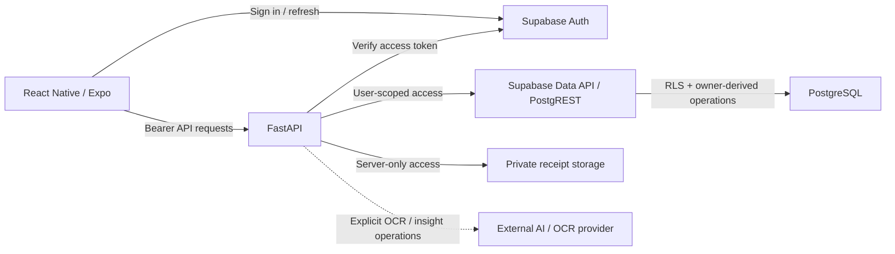

<div align="center">

# FinanceFlow

**Mobile personal finance engineered for correctness under failure.**

FinanceFlow is a React Native / Expo personal-finance application backed by FastAPI, Supabase Auth, PostgreSQL RLS, and private receipt storage. Its engineering focus is preserving financial intent, ownership, and exact money semantics when networks, retries, sessions, or external providers fail unpredictably.

[English](README.md) · [Português](docs/i18n/pt-BR/README.md) · [日本語](docs/i18n/ja/README.md) · [Español](docs/i18n/es/README.md)

[](https://github.com/Gyliardson/FinanceFlow/actions/workflows/ci.yml)
[](LICENSE)

</div>

## Overview

FinanceFlow combines everyday personal-finance workflows with explicit correctness boundaries for monetary arithmetic, authentication, retries, private documents, and date-only financial semantics. The project favors narrow, testable guarantees over broad claims: repository CI proves specific contracts, while production credentials, remote platform settings, and physical-device behavior remain separate evidence domains.

## Why FinanceFlow?

| Financial correctness | Privacy & authorization | Reliability & assurance |
| --- | --- | --- |
| Exact decimal money, `America/Sao_Paulo` DATE-only semantics, and durable financial idempotency. | Supabase Auth, PostgreSQL RLS, private receipt storage, and owner-scoped local state. | Ambiguous-outcome reconciliation, deterministic CI, and an independent FinanceFlow Trust Verifier. |

## Core capabilities

- one-time bills and monthly recurring obligations;
- income tracking and payment state;
- private payment receipts with authorized bounded access;
- emergency-fund/reserve **addition** and goal tracking — no reserve withdrawal/decrement endpoint is currently exposed;
- local due-date reminders with privacy-conscious notification copy;
- owner-scoped offline **read** resilience for supported financial data;
- OCR-assisted receipt extraction with validation/manual-review boundaries;
- financial insights with explicit external-provider refresh rather than passive background invocation.

## Architecture



The normal financial data plane keeps end-user identity attached to Data API requests so PostgreSQL RLS remains the cross-owner isolation boundary. Server-only storage/provider credentials are not exposed to the mobile bundle.

## Technical highlights

- **Authenticated data plane.** Bearer sessions are verified before user-scoped Data API access; direct authenticated table DML is restricted in favor of sanctioned owner-derived RPCs.
- **PostgreSQL RLS owner isolation.** Financial rows remain scoped by `auth.uid()` / `owner_id` rather than trusting caller-provided ownership.
- **Exact decimal money.** Authoritative monetary arithmetic uses decimal semantics and fixed-scale persistence instead of binary floating-point money.
- **Financial DATE-only semantics.** Business dates are derived in `America/Sao_Paulo` through timezone-aware calendar logic rather than UTC string slicing.
- **Durable `Idempotency-Key` protocol.** Bill creation, income creation, reserve addition, and recurring-template creation use database-backed replay identity and payload conflict detection.
- **Original payload preservation.** An unresolved submitted intent retains its replay key and complete original payload across retry/reconnect/restart.
- **Ambiguous-outcome reconciliation.** Transport failure is not treated as proof of rollback when a server effect may already have committed.
- **Owner-scoped SecureStore state.** Sensitive sessions, supported financial cache data, and unresolved mutation identity use owner-isolated secure local persistence.
- **Private receipt storage.** Receipt objects use owner/bill-scoped paths and bounded signed access after authorization; ambiguous writes are reconciled before cleanup.
- **Untrusted OCR/AI output.** External output is validated locally; low-confidence/unreadable OCR requires review, and passive insight reads do not invoke the provider.
- **Experimental adapters fail closed.** Optional external collectors do not bypass human verification/access controls and do not independently create authoritative financial records.
- **Deterministic CI.** Financial, auth, database, mobile, build, dependency, and secret contracts are exercised without depending on live provider success.
- **Independent Trust Verifier.** A separate GitHub App rereads candidate bytes and evaluates an independently held supply-chain policy before publishing its Check Run.

> Pending financial-mutation state is **not** a general offline write queue. New financial mutations remain online-only; pending state exists to reconcile an already-submitted operation whose outcome is ambiguous.

## Security & financial correctness

FinanceFlow treats authentication, storage, financial arithmetic, idempotency, and external-provider output as explicit trust boundaries. Important details are specified in the [Security model](backend/SECURITY_MODEL.md), [Financial rules](backend/FINANCIAL_RULES.md), [Authenticated data plane](docs/security/AUTHENTICATED_DATA_PLANE.md), and [Logical intent identity](docs/architecture/LOGICAL_INTENT_IDENTITY.md).

The security model does not imply that `SECURITY DEFINER` is safe by itself. Owner-derived functions rely on `auth.uid()`, restricted execution, fixed `search_path`, bounded parameters, and tested database invariants. Likewise, a receipt persistence exception is treated as ambiguous until authoritative owner-scoped state determines whether the uploaded object is referenced.

## Quick Start

### Requirements

- Python **3.12**.
- Node.js 22.13+ for the current mobile toolchain.
- A Supabase project and the environment values documented in the repository examples for real authenticated runtime use.

### Backend

```bash
cd backend
python -m venv .venv
# Linux/macOS: source .venv/bin/activate
# Windows PowerShell: .venv\Scripts\Activate.ps1
python -m pip install -r requirements.txt
uvicorn runtime:create_app --factory --reload
```

Use `backend/.env.example` as the configuration reference. Never expose `SUPABASE_SERVICE_ROLE_KEY`, database credentials, or provider secrets to the mobile application.

### Mobile

```bash
cd mobile
npm ci
npx tsc --noEmit
npx expo-doctor
```

Expo SDK 57 physical-device development uses the project's **Development Build + Metro** workflow. Follow the canonical [Android local-development runbook](docs/operations/MOBILE_LOCAL_ANDROID.md) to install the development client and then run Metro with the reviewed public configuration. Do not treat a bare `npx expo start` as the complete physical-device setup path.

For a clean candidate-validation procedure, see the [clean-room runbook](docs/operations/CLEAN_ROOM.md).

## Quality & independent trust

Repository checks cover backend tests, PostgreSQL ownership/RLS, recurring/idempotency behavior, the authenticated data plane, mobile auth/UX contracts, Expo health, the production backend image, dependency evidence, and full-history secret scanning. Each gate is evidence for a bounded property rather than a universal security or production-readiness claim.

The external **FinanceFlow Trust Verifier** is independently deployed. For pull-request candidates it rereads the candidate tree from GitHub and evaluates `financeflow-trust-policy/v2` from the separate verifier repository. Documentation-only changes must pass without changing trusted workflows, Dockerfile inventory, bound blobs, or the verifier baseline.

See [Quality evidence](docs/assurance/QUALITY_EVIDENCE.md), [Governance](docs/assurance/GOVERNANCE.md), and the [Secret scan gate](docs/assurance/SECRET_SCAN_GATE.md).

## Documentation

[Technical documentation](docs/README.md) is organized by architecture, security, operations, assurance, backend domain contracts, and mobile contracts.

Useful entry points:

- [Architecture and trust boundaries](docs/architecture/ARCHITECTURE.md)
- [Offline resilience](docs/architecture/OFFLINE_RESILIENCE.md)
- [Deployment](docs/operations/DEPLOYMENT.md)
- [Android local development](docs/operations/MOBILE_LOCAL_ANDROID.md)
- [Financial rules](backend/FINANCIAL_RULES.md)
- [Security model](backend/SECURITY_MODEL.md)
- [OCR security](backend/OCR_SECURITY.md)

## Experimental boundaries / limitations

- Offline support is read resilience, not offline financial mutation synchronization.
- Reserve operations currently expose addition only; withdrawal/decrement is not implemented as a supported endpoint.
- DASMEI, TIM, Unopar, IMAP/PDF, and related scheduler paths are experimental/opt-in; third-party availability is not guaranteed.
- OCR and generated insights are provider-assisted outputs, not authoritative financial truth.
- CI does not provision real Supabase/Render/EAS credentials or prove live external platform configuration.
- Signed native builds, store distribution, and physical-device behavior require external/operator evidence when relevant.
- Residual non-critical Expo/Metro/npm advisories may remain when no compatible safe patched path exists; incompatible forced dependency changes are not used merely to report zero advisories.

## License

FinanceFlow is licensed under the **Apache License 2.0** (`Apache-2.0`). See [LICENSE](LICENSE) for the canonical legal text.

## Author

**Gyliardson Keitison** · [GitHub](https://github.com/Gyliardson) · [LinkedIn](https://www.linkedin.com/in/gyliardson-keitison)
