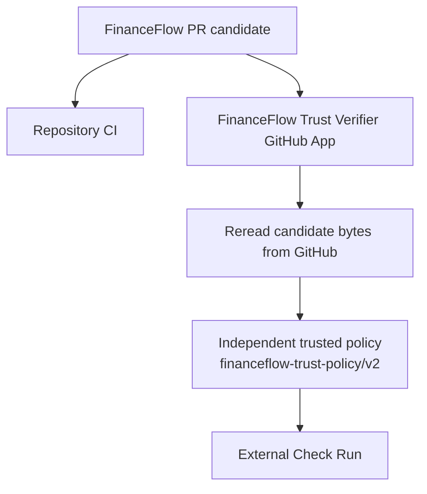

# FinanceFlow quality and verification evidence

FinanceFlow treats green CI as evidence for specific properties, not as a blanket claim that every production concern has been proven. This document maps major risks to the repository gates that exercise them and states important gaps explicitly.

## Gate matrix

| Gate / workflow | What it proves | What it does not prove |
| --- | --- | --- |
| `FinanceFlow CI` | Backend dependency installation, `pip check`, Python compile/tests, PostgreSQL recurring-child uniqueness, PostgreSQL ownership/RLS, mobile TypeScript, dependency-audit evidence, and Gitleaks | Live production credentials, native-device behavior, third-party portal availability |
| `Financial idempotency` | PostgreSQL 16 durable replay contract for reserve addition, bill creation, income creation, and recurring-template creation, including same-key concurrency, payload mismatch, and owner isolation | Mobile logical-intent lifecycle by itself; live production database configuration |
| `Authenticated data plane` | PostgreSQL 16 enforcement of authenticated direct-table DML denial plus sanctioned owner-derived RPC writes, including payment/date/ownership constraints, settings scope, recurring convergence, and anonymous denial | Live production database provisioning or external Supabase configuration |
| `Mobile auth contract` | Session restore/refresh/logout/account-switch isolation, owner-scoped offline cache, durable mobile logical-intent identity/original-payload replay, coherent session snapshots, and the `America/Sao_Paulo` financial date-only contract | Real Supabase service uptime or every OS keychain implementation |
| `Mobile UX contract` | Source-level regression contracts for critical financial screen states, accessibility semantics, upload guards, and fail-closed dashboard behavior | Pixel-perfect visual approval or native assistive-technology behavior on physical devices |
| `Mobile Expo health` | Clean mobile install, TypeScript, Expo Doctor, public config checks, release-env contract, and web-export smoke | Signed Android/iOS store builds unless external EAS credentials are supplied |
| `Backend container` | Declared backend Docker image builds and its production FastAPI factory/runtime contract remains usable | Render account provisioning or production network/DNS configuration |
| `Supply-chain policy` | Repository-controlled immutable workflow/build input policy and deterministic mutation controls | Upstream compromise of an already reviewed immutable dependency or organization-level GitHub policy |

Repository workflow definitions live in [`.github/workflows/`](../../.github/workflows/).

## Independent trust path

FinanceFlow also uses an independently deployed GitHub App verifier. It is not a second copy of repository CI: it rereads the PR candidate bytes from GitHub and evaluates the configured trusted policy from the separate verifier repository before publishing its Check Run.

The verifier's green result is evidence that its independently held policy accepted that exact candidate. It is not a generic certification of every product property, and repository documentation changes must not rebaseline the verifier merely to obtain a pass.

## Critical risk coverage

### Financial correctness, logical intent, and ambiguous outcomes

Evidence includes:

- exact decimal-money unit/domain tests;
- zero, negative, large-value, sub-cent, and rounding-boundary scenarios;
- PostgreSQL numeric round trips;
- monthly recurrence edge cases around 28/29/30/31, leap years, and year transitions;
- migration behavior that fails closed on unsafe historical duplicate states;
- concurrent recurring-instance insertion proving the database uniqueness boundary;
- retry/bulk-conflict recovery cases;
- receipt-backed payment tests that explicitly distinguish fail-before-commit from commit-then-response-loss;
- reconciliation proving a receipt referenced by a committed payment is preserved and remains available through authorized signed access;
- durable `Idempotency-Key` replay for reserve addition, ordinary bill creation, income creation, and recurring-template creation;
- same-key sequential/concurrent replay, changed-payload rejection, cross-owner isolation, intentional new-key repetition, and commit-response-loss retry;
- mobile pending records persisting the original complete payload and operation key before transport;
- deterministic income-midnight regression proving a retry after date rollover uses the same key and original pre-midnight payload;
- coherent mobile mutation-session snapshots tying owner, access token, and session generation together and failing closed on account switch;
- owner-isolated encrypted pending state across logout/account switch.

The key claim, financial effect, and durable replay result share the same PostgreSQL transaction. The mobile layer does not replace that ledger; it preserves the logical identity required to exercise the ledger correctly. Generated recurring-child uniqueness is a separate invariant and is not used as a substitute for recurring-template creation idempotency.

Canonical rules: [Financial rules](../../backend/FINANCIAL_RULES.md) and [Logical intent identity](../architecture/LOGICAL_INTENT_IDENTITY.md).

### Financial date-only semantics

Evidence distinguishes business-calendar dates from timestamps:

- product financial timezone is the IANA zone `America/Sao_Paulo`;
- mobile derives financial `YYYY-MM-DD` through the canonical timezone-aware helper rather than UTC slicing;
- deterministic coverage spans local midnight, UTC-next-day windows, month/year rollover, and historical IANA offset behavior;
- backend coverage proves `initial_balance_date` changes which same-day income/payment records enter authoritative balance calculation;
- static guards prevent reintroduction of UTC slicing in financial date-only call sites without banning legitimate timestamp serialization.

### Authentication, ownership, and privacy

Evidence includes:

- missing/malformed/invalid/expired credential paths;
- verified request-scoped user context;
- PostgreSQL RLS tests under non-owner roles;
- cross-user read/update denial and forged-owner rejection;
- anonymous financial-table denial;
- authenticated direct-table INSERT/UPDATE/DELETE denial;
- sanctioned owner-derived financial/settings/payment RPC boundaries;
- private receipt-path authorization and bounded signed access;
- mobile session restore, refresh, logout, and account-switch isolation;
- coherent mutation preparation preventing cross-owner token/namespace combinations;
- unresolved financial payloads stored owner-scoped in SecureStore;
- secret scanning.

Canonical security model: [Security model](../../backend/SECURITY_MODEL.md) and [Authenticated data plane](../security/AUTHENTICATED_DATA_PLANE.md).

### Receipt/storage integrity

Receipt uploads are bounded and validated from file signatures rather than filename alone. Receipt objects are private and owner/bill-scoped. A Data API/transport exception after upload is an ambiguous outcome rather than proof of rollback: the backend re-reads authoritative RLS-scoped state and deletes the uploaded object only after that state proves the object is not referenced.

If reconciliation itself is unavailable, the object is retained fail-safe. Preserving a bounded possible orphan is safer than destroying evidence that an already-committed payment still references.

### Upload / OCR / AI boundary

Evidence includes synthetic deterministic coverage for supported content signatures, MIME mismatch, malformed/oversized input, structured-output validation, provider failures, and low-confidence/manual-review behavior. CI does not depend on live provider calls.

OCR/AI output remains untrusted until locally validated. Passive insights reads do not invoke the external provider; explicit refresh does. See [OCR security](../../backend/OCR_SECURITY.md) and [AI privacy](../security/AI_PRIVACY.md).

### Offline resilience and mutation identity

Evidence includes owner-scoped cache envelopes, corruption handling, freshness metadata, restart/session restore, invalid-vs-transient auth behavior, account isolation, and the explicit rule that offline cache is read resilience.

New financial mutations remain online-only. Owner-scoped pending records exist only for already-submitted ambiguous non-convergent operations so the same original key/payload can be replayed; they are **not** a general offline write queue.

Canonical offline model: [Offline resilience](../architecture/OFFLINE_RESILIENCE.md).

### Repository governance and supply chain

Repository-defined governance protects workflow/context names and immutable build inputs. The local contract includes `Authenticated data plane` / `PostgreSQL authenticated write boundary` and the always-on source-defined contexts guarded by the governance tests.

Remote GitHub rulesets, required-check configuration, bypass actors, secrets, and environment protections are operator-managed state. They must be re-read when a decision depends on them rather than inferred from a dated document snapshot.

Details: [Governance](./GOVERNANCE.md).

### Mobile build/configuration

The current mobile baseline is Expo SDK 57 / React Native 0.86. Repository checks verify clean dependency installation, TypeScript, Expo Doctor, public configuration, release-environment contracts, and a web export smoke.

Physical-device local development uses the documented Development Build + Metro path. Remote signed Android/iOS builds still depend on operator-controlled EAS credentials and therefore remain an external/manual concern when required. See [Android local development](../operations/MOBILE_LOCAL_ANDROID.md).

### Experimental integrations

DASMEI, TIM, Unopar, and IMAP/PDF tests use fixtures/deterministic boundaries. CI does not depend on live portals, private credentials, or CAPTCHA/human-verification bypasses. The adapters are opt-in and are not registered as authoritative production financial mutation routes. External compatibility is therefore a documented runtime limitation, not a hidden CI assumption.

## Dependency and secret evidence

The mobile npm graph keeps residual upstream/tooling advisories visible when no compatible patched Expo/Metro/React Native path exists. The repository does not use forced incompatible dependency changes merely to manufacture a zero-finding result.

Passing Gitleaks reduces the risk of committed secrets but does not replace operator-side secret rotation, least privilege, or external platform configuration review. The secret-history scope is documented in [Secret scan gate](./SECRET_SCAN_GATE.md).

## Review discipline

A change is not considered ready because one narrow test passed. Relevant work requires code/documentation alignment, exact-head gates, diff review, and an appropriate reviewed PR to `main`.

Historical `portfolio/revamp-2026` integration language describes a completed hardening lifecycle, not the forward development model. Workflow triggers that still mention historical branches remain repository-defined compatibility until deliberately changed in a separate scope.

CI evidence must be interpreted narrowly: source-level accessibility/layout defenses and build smoke can be automated, but native visual or physical-device approval is not claimed unless rendered/device evidence was actually inspected.
