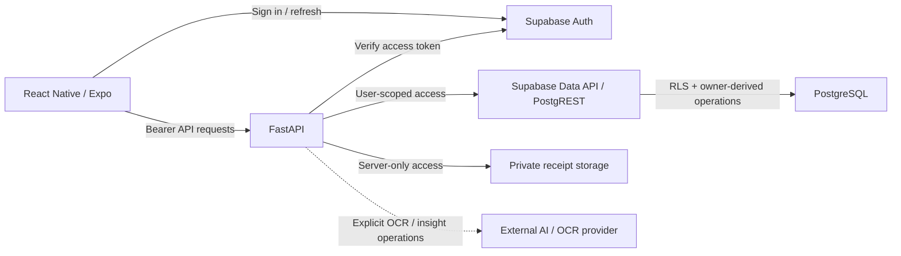

<div align="center">

# FinanceFlow

**Finanzas personales móviles diseñadas para conservar la corrección incluso ante fallos.**

FinanceFlow es una aplicación móvil de finanzas personales en React Native / Expo, respaldada por FastAPI, Supabase Auth, PostgreSQL RLS y almacenamiento privado de comprobantes. Su enfoque de ingeniería es preservar la intención financiera, la propiedad de los datos y la semántica monetaria exacta cuando la red, los reintentos, las sesiones o los proveedores externos fallan de forma impredecible.

[English](../../../README.md) · [Português](../pt-BR/README.md) · [日本語](../ja/README.md) · [Español](README.md)

[](https://github.com/Gyliardson/FinanceFlow/actions/workflows/ci.yml)
[](../../../LICENSE)

</div>

## Descripción general

FinanceFlow combina flujos cotidianos de finanzas personales con límites explícitos de corrección para aritmética monetaria, autenticación, reintentos, documentos privados y semántica financiera DATE-only. El proyecto prefiere garantías acotadas y comprobables en lugar de claims generales: el CI del repositorio demuestra contratos concretos, mientras que credenciales de producción, configuración remota y comportamiento en dispositivos físicos pertenecen a dominios de evidencia separados.

## ¿Por qué FinanceFlow?

| Corrección financiera | Privacidad y autorización | Fiabilidad y assurance |
| --- | --- | --- |
| Dinero decimal exacto, semántica DATE-only en `America/Sao_Paulo` e idempotencia financiera duradera. | Supabase Auth, PostgreSQL RLS, comprobantes privados y estado local por owner. | Reconciliación de resultados ambiguos, CI determinista y FinanceFlow Trust Verifier independiente. |

## Capacidades principales

- facturas únicas y obligaciones mensuales recurrentes;
- registro de ingresos y estado de pagos;
- comprobantes privados con acceso autorizado y temporal;
- **adición** a la reserva/fondo de emergencia y seguimiento de meta — actualmente no existe endpoint de retiro/decremento de la reserva;
- recordatorios locales de vencimiento con contenido orientado a la privacidad;
- resiliencia offline de **lectura** por owner para los datos financieros soportados;
- extracción asistida por OCR con validación y límites de revisión manual;
- insights financieros con actualización explícita mediante proveedor externo, sin invocación pasiva en segundo plano.

## Arquitectura



El plano de datos financiero normal conserva el contexto del usuario final en las solicitudes para que PostgreSQL RLS siga siendo la frontera de aislamiento entre owners. Las credenciales de storage/proveedor exclusivas del servidor no se exponen al bundle móvil.

## Aspectos técnicos destacados

- **Plano de datos autenticado.** Las sesiones Bearer se verifican antes del acceso Data API por usuario; el DML directo de tablas para `authenticated` se restringe en favor de RPCs sancionadas que derivan el owner.
- **Aislamiento por owner con PostgreSQL RLS.** Las filas financieras se limitan mediante `auth.uid()` / `owner_id`, sin confiar en ownership enviado por el cliente.
- **Dinero decimal exacto.** La aritmética monetaria autoritativa utiliza semántica decimal y persistencia de escala fija, no punto flotante binario.
- **Semántica financiera DATE-only.** Las fechas de negocio se derivan en `America/Sao_Paulo` con lógica de calendario timezone-aware, no recortando cadenas UTC.
- **Protocolo duradero `Idempotency-Key`.** La creación de factura, ingreso, adición a reserva y template recurrente usa identidad de replay persistida en base de datos y detección de conflicto de payload.
- **Preservación del payload original.** Una intención ya enviada y no resuelta conserva su replay key y el payload completo original entre retry/reconnect/restart.
- **Reconciliación de resultado ambiguo.** Un fallo de transporte no se considera prueba de rollback cuando un efecto del servidor puede haberse confirmado ya.
- **Estado SecureStore por owner.** Sesiones sensibles, cache financiero soportado e identidad de mutación sin resolver usan persistencia local segura y aislada por owner.
- **Comprobantes privados.** Los objetos usan paths por owner/factura y acceso firmado limitado tras autorización; las escrituras ambiguas se reconcilian antes del cleanup.
- **Salida OCR/AI no confiable.** La salida externa se valida localmente; OCR ilegible/de baja confianza requiere revisión y una lectura pasiva de insights no llama al proveedor.
- **Adapters experimentales fail closed.** Los colectores opcionales no eluden controles de acceso/verificación humana ni crean por sí solos registros financieros autoritativos.
- **CI determinista.** Los contratos financieros, auth, base de datos, móvil, build, dependencias y secrets se ejercitan sin depender del éxito de proveedores live.
- **Trust Verifier independiente.** Un GitHub App separado relee los bytes del candidato y evalúa una policy mantenida de forma independiente antes de publicar su Check Run.

> El estado de mutación financiera pendiente **no** es una cola genérica de escritura offline. Las nuevas mutaciones financieras siguen siendo online-only; el estado pendiente existe para reconciliar una operación ya enviada cuyo resultado quedó ambiguo.

## Seguridad y corrección financiera

FinanceFlow trata autenticación, storage, aritmética financiera, idempotencia y salida de proveedores externos como fronteras explícitas de confianza. Los detalles están en [Security model](../../../backend/SECURITY_MODEL.md), [Financial rules](../../../backend/FINANCIAL_RULES.md), [Authenticated data plane](../../security/AUTHENTICATED_DATA_PLANE.md) y [Logical intent identity](../../architecture/LOGICAL_INTENT_IDENTITY.md).

El modelo no implica que `SECURITY DEFINER` sea seguro por sí mismo. Las funciones que derivan el owner dependen de `auth.uid()`, ejecución restringida, `search_path` fijo, parámetros acotados e invariantes de base de datos probadas. Del mismo modo, una excepción al persistir un pago con comprobante se trata como ambigua hasta que el estado autoritativo por owner determine si el objeto cargado está referenciado.

## Inicio rápido

### Requisitos

- Python **3.12**.
- Node.js 22.13+ para el toolchain móvil actual.
- Un proyecto Supabase y los valores de entorno documentados en los ejemplos del repositorio para uso autenticado real.

### Backend

```bash
cd backend
python -m venv .venv
# Linux/macOS: source .venv/bin/activate
# Windows PowerShell: .venv\Scripts\Activate.ps1
python -m pip install -r requirements.txt
uvicorn runtime:create_app --factory --reload
```

Use `backend/.env.example` como referencia. Nunca exponga `SUPABASE_SERVICE_ROLE_KEY`, credenciales de base de datos ni secrets de proveedor a la aplicación móvil.

### Mobile

```bash
cd mobile
npm ci
npx tsc --noEmit
npx expo-doctor
```

El desarrollo en dispositivo físico con Expo SDK 57 usa **Development Build + Metro**. Siga el [runbook canónico de desarrollo local Android](../../operations/MOBILE_LOCAL_ANDROID.md) para instalar el development client y después iniciar Metro con la configuración pública revisada. Un `npx expo start` aislado no representa toda la configuración física.

Para validar un candidato desde un entorno limpio, consulte el [runbook clean-room](../../operations/CLEAN_ROOM.md).

## Calidad y confianza independiente

Los checks del repositorio cubren pruebas backend, ownership/RLS de PostgreSQL, recurrencia/idempotencia, plano de datos autenticado, contratos móviles de auth/UX, salud de Expo, imagen de producción del backend, evidencia de dependencias y escaneo de secrets sobre el historial. Cada gate prueba una propiedad acotada; no constituye una afirmación universal de seguridad o production readiness.

El **FinanceFlow Trust Verifier** externo se despliega de forma independiente. Para candidatos de PR relee el árbol desde GitHub y evalúa `financeflow-trust-policy/v2` desde el repositorio separado del verifier. Los cambios solo documentales deben pasar sin modificar workflows confiables, inventario de Dockerfile, blobs bound ni baseline del verifier.

Consulte [Quality evidence](../../assurance/QUALITY_EVIDENCE.md), [Governance](../../assurance/GOVERNANCE.md) y [Secret scan gate](../../assurance/SECRET_SCAN_GATE.md).

## Documentación

La [documentación técnica](../../README.md) está organizada por arquitectura, seguridad, operaciones, assurance, contratos de dominio backend y contratos móviles.

Puntos de entrada útiles:

- [Architecture and trust boundaries](../../architecture/ARCHITECTURE.md)
- [Offline resilience](../../architecture/OFFLINE_RESILIENCE.md)
- [Deployment](../../operations/DEPLOYMENT.md)
- [Android local development](../../operations/MOBILE_LOCAL_ANDROID.md)
- [Financial rules](../../../backend/FINANCIAL_RULES.md)
- [Security model](../../../backend/SECURITY_MODEL.md)
- [OCR security](../../../backend/OCR_SECURITY.md)

## Fronteras experimentales / limitaciones

- El soporte offline es resiliencia de lectura, no sincronización offline de mutaciones financieras.
- Las operaciones de reserva exponen solo adición; retiro/decremento no es actualmente un endpoint soportado.
- DASMEI, TIM, Unopar, IMAP/PDF y el scheduler relacionado son experimentales/opt-in; no se garantiza la disponibilidad de terceros.
- OCR e insights generados son salidas asistidas por proveedor, no verdad financiera autoritativa.
- CI no provisiona credenciales reales de Supabase/Render/EAS ni prueba configuración live de esas plataformas.
- Builds nativos firmados, distribución en stores y comportamiento en dispositivo físico requieren evidencia externa/del operador cuando corresponda.
- Pueden permanecer advisories no críticos de Expo/Metro/npm cuando no exista una solución compatible y segura; no se fuerzan cambios incompatibles solo para informar cero advisories.

## Licencia

FinanceFlow está licenciado bajo **Apache License 2.0** (`Apache-2.0`). Consulte [LICENSE](../../../LICENSE) para el texto legal canónico; no se traduce en este README.

## Autor

**Gyliardson Keitison** · [GitHub](https://github.com/Gyliardson) · [LinkedIn](https://www.linkedin.com/in/gyliardson-keitison)
