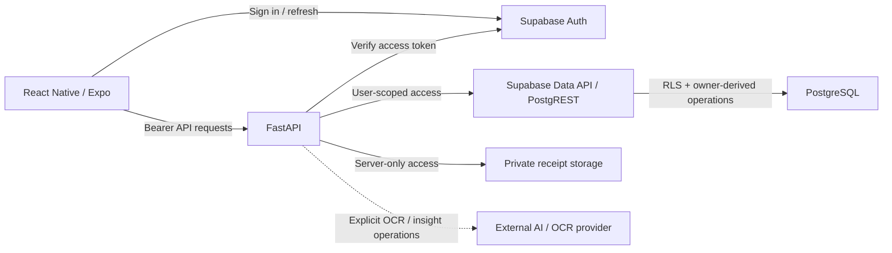

<div align="center">

# FinanceFlow

**障害時にも正しさを維持することを重視した、モバイル個人資産管理アプリ。**

FinanceFlow は React Native / Expo を使用した個人向けファイナンスアプリで、FastAPI、Supabase Auth、PostgreSQL RLS、非公開レシートストレージを組み合わせています。ネットワーク、リトライ、セッション、外部プロバイダーが予測不能に失敗しても、金融操作の意図、データ所有権、正確な金額表現を保つことを設計上の中心に置いています。

[English](../../../README.md) · [Português](../pt-BR/README.md) · [日本語](README.md) · [Español](../es/README.md)

[](https://github.com/Gyliardson/FinanceFlow/actions/workflows/ci.yml)
[](../../../LICENSE)

</div>

## 概要

FinanceFlow は日常的な個人資産管理機能に加え、金額計算、認証、リトライ、非公開文書、金融上の DATE-only セマンティクスに明示的な正しさの境界を設けています。広い安全性を抽象的に主張するのではなく、リポジトリ CI が特定の契約を検証し、本番認証情報、リモート設定、実機挙動は別の証拠領域として扱います。

## FinanceFlow が重視すること

| 金融上の正しさ | プライバシーと認可 | 信頼性と検証 |
| --- | --- | --- |
| 正確な十進金額、`America/Sao_Paulo` の DATE-only セマンティクス、永続的な金融 idempotency。 | Supabase Auth、PostgreSQL RLS、非公開レシート、owner ごとのローカル状態。 | あいまいな結果の reconciliation、決定論的 CI、独立した FinanceFlow Trust Verifier。 |

## 主な機能

- 単発の請求と月次の定期支払い;
- 収入と支払い状態の管理;
- 認可後に期限付きでアクセスする非公開の支払いレシート;
- 緊急資金 / reserve への**追加**と目標管理 — 現在、reserve の引き出し / decrement endpoint はありません;
- プライバシーに配慮したローカル期限リマインダー;
- owner ごとの金融データに対するオフライン**読み取り**耐障害性;
- 検証と手動レビュー境界を持つ OCR 支援抽出;
- 外部プロバイダーを明示的に更新操作で呼び出す金融インサイト。

## アーキテクチャ



通常の金融データプレーンではエンドユーザーの認証コンテキストを Data API リクエストに保持し、PostgreSQL RLS を owner 間の分離境界として維持します。サーバー専用の storage / provider 認証情報をモバイル bundle に公開しません。

## 技術的なポイント

- **認証済みデータプレーン。** Bearer session を検証してから user-scoped Data API に接続し、`authenticated` の直接 table DML を制限して owner-derived RPC を使用します。
- **PostgreSQL RLS による owner 分離。** `auth.uid()` / `owner_id` を認可境界とし、クライアントが提示する owner を信頼しません。
- **正確な十進金額。** 金額の権威的な計算と永続化で binary floating point を避けます。
- **金融 DATE-only セマンティクス。** `America/Sao_Paulo` の timezone-aware calendar logic を使用し、UTC 文字列の切り出しで金融日付を作りません。
- **永続的な `Idempotency-Key`。** bill、income、reserve addition、recurring-template creation は database-backed replay と payload conflict 検出を使用します。
- **original payload の保持。** 送信済みで結果が未確定の intent は、retry/reconnect/restart 後も同じ key と最初の完全な payload を再利用します。
- **あいまいな結果の reconciliation。** transport failure を rollback の証明とは扱いません。
- **owner-scoped SecureStore。** session、対応する financial cache、未解決 mutation identity を owner ごとに安全に保存します。
- **非公開レシート。** owner/bill-scoped object path と認可後の bounded signed access を使用し、ambiguous write は cleanup 前に reconciliation します。
- **OCR/AI 出力は未信頼。** 外部出力をローカルで再検証し、低 confidence / unreadable OCR はレビュー対象にします。passive insight read は provider を呼びません。
- **experimental adapter は fail closed。** human verification / access-control を回避せず、単独で authoritative financial record を作りません。
- **決定論的 CI。** 金融、auth、database、mobile、build、dependency、secret の契約を live provider 成功に依存せず検証します。
- **独立 Trust Verifier。** 別の GitHub App が candidate bytes を再取得し、独立管理された policy で評価して Check Run を公開します。

> Pending financial mutation state は、一般的な offline write queue では**ありません**。新規の金融 mutation は online-only のままであり、pending state はすでに送信した操作の結果があいまいな場合に reconciliation するためだけに存在します。

## セキュリティと金融上の正しさ

FinanceFlow は認証、storage、金融計算、idempotency、外部 provider output を明示的な trust boundary として扱います。詳細は [Security model](../../../backend/SECURITY_MODEL.md)、[Financial rules](../../../backend/FINANCIAL_RULES.md)、[Authenticated data plane](../../security/AUTHENTICATED_DATA_PLANE.md)、[Logical intent identity](../../architecture/LOGICAL_INTENT_IDENTITY.md) を参照してください。

`SECURITY DEFINER` 自体を安全性の主張にはしません。owner-derived function の境界は `auth.uid()`、制限された実行権限、固定 `search_path`、限定された parameter、検証済み database invariant に依存します。また、receipt persistence の例外は rollback の証明ではなく、owner-scoped authoritative state が object の参照有無を確定するまで ambiguous outcome として扱います。

## Quick Start

### 要件

- Python **3.12**.
- 現在の mobile toolchain 用 Node.js 22.13+.
- 実際の認証付き runtime には Supabase project と repository example に記載された environment values が必要です。

### Backend

```bash
cd backend
python -m venv .venv
# Linux/macOS: source .venv/bin/activate
# Windows PowerShell: .venv\Scripts\Activate.ps1
python -m pip install -r requirements.txt
uvicorn runtime:create_app --factory --reload
```

設定の参照元は `backend/.env.example` です。`SUPABASE_SERVICE_ROLE_KEY`、database credential、provider secret を mobile app に公開しないでください。

### Mobile

```bash
cd mobile
npm ci
npx tsc --noEmit
npx expo-doctor
```

Expo SDK 57 の実機開発では **Development Build + Metro** を使用します。[Android ローカル開発 runbook](../../operations/MOBILE_LOCAL_ANDROID.md) に従って development client をインストールし、レビュー済み public configuration で Metro を起動してください。単独の `npx expo start` は実機セットアップ全体を表しません。

candidate の clean-room 検証は [clean-room runbook](../../operations/CLEAN_ROOM.md) を参照してください。

## 品質と独立した trust

Repository checks は backend tests、PostgreSQL ownership/RLS、recurring/idempotency、authenticated data plane、mobile auth/UX contracts、Expo health、backend production image、dependency evidence、full-history secret scanning を対象にします。各 gate は限定された性質の証拠であり、普遍的な安全性や production readiness の主張ではありません。

外部の **FinanceFlow Trust Verifier** は独立して deploy されています。PR candidate の tree を GitHub から再取得し、別 repository の `financeflow-trust-policy/v2` で評価します。documentation-only change は trusted workflow、Dockerfile inventory、bound blob、verifier baseline を変更せずに通過する必要があります。

[Quality evidence](../../assurance/QUALITY_EVIDENCE.md)、[Governance](../../assurance/GOVERNANCE.md)、[Secret scan gate](../../assurance/SECRET_SCAN_GATE.md) も参照してください。

## ドキュメント

[技術ドキュメント](../../README.md) は Architecture、Security、Operations、Assurance、backend domain contracts、mobile contracts に整理されています。

主な入口:

- [Architecture and trust boundaries](../../architecture/ARCHITECTURE.md)
- [Offline resilience](../../architecture/OFFLINE_RESILIENCE.md)
- [Deployment](../../operations/DEPLOYMENT.md)
- [Android local development](../../operations/MOBILE_LOCAL_ANDROID.md)
- [Financial rules](../../../backend/FINANCIAL_RULES.md)
- [Security model](../../../backend/SECURITY_MODEL.md)
- [OCR security](../../../backend/OCR_SECURITY.md)

## Experimental boundaries / limitations

- Offline support は読み取り耐障害性であり、金融 mutation の offline synchronization ではありません。
- Reserve operation は現在 addition のみで、withdrawal/decrement endpoint はありません。
- DASMEI、TIM、Unopar、IMAP/PDF、および関連 scheduler は experimental / opt-in で、第三者サービスの可用性は保証しません。
- OCR と生成 insight は provider-assisted output であり、authoritative financial truth ではありません。
- CI は実際の Supabase/Render/EAS credential を provision せず、live external platform configuration を証明しません。
- signed native build、store distribution、physical-device behavior は必要に応じて external/operator evidence が必要です。
- 互換性のある安全な修正版が存在しない場合、Expo/Metro/npm の non-critical advisory が残ることがあります。advisory 数をゼロにするためだけの非互換な強制変更は行いません。

## ライセンス

FinanceFlow は **Apache License 2.0** (`Apache-2.0`) でライセンスされています。法的本文は翻訳せず、canonical な [LICENSE](../../../LICENSE) を参照してください。

## 作者

**Gyliardson Keitison** · [GitHub](https://github.com/Gyliardson) · [LinkedIn](https://www.linkedin.com/in/gyliardson-keitison)
