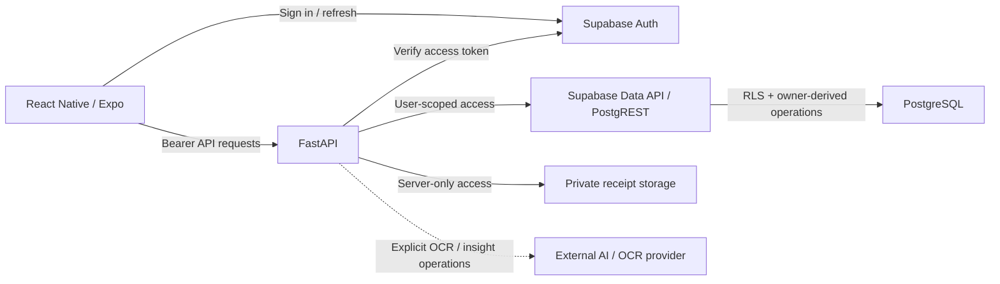

<div align="center">

# FinanceFlow

**Finanças pessoais mobile projetadas para manter a correção mesmo sob falhas.**

FinanceFlow é uma aplicação mobile de finanças pessoais em React Native / Expo, com FastAPI, Supabase Auth, PostgreSQL RLS e armazenamento privado de comprovantes. O foco de engenharia é preservar intenção financeira, propriedade dos dados e semântica monetária exata quando rede, retries, sessões ou provedores externos falham de forma imprevisível.

[English](../../../README.md) · [Português](README.md) · [日本語](../ja/README.md) · [Español](../es/README.md)

[](https://github.com/Gyliardson/FinanceFlow/actions/workflows/ci.yml)
[](../../../LICENSE)

</div>

## Visão geral

FinanceFlow combina fluxos cotidianos de finanças pessoais com limites explícitos de correção para aritmética monetária, autenticação, retries, documentos privados e datas financeiras sem horário. O projeto prefere garantias estreitas e testáveis a claims amplos: o CI do repositório prova contratos específicos, enquanto credenciais de produção, configurações remotas e comportamento em dispositivo físico pertencem a domínios de evidência separados.

## Por que FinanceFlow?

| Correção financeira | Privacidade e autorização | Confiabilidade e garantia |
| --- | --- | --- |
| Dinheiro decimal exato, semântica DATE-only em `America/Sao_Paulo` e idempotência financeira durável. | Supabase Auth, PostgreSQL RLS, comprovantes privados e estado local por owner. | Reconciliação de resultados ambíguos, CI determinístico e FinanceFlow Trust Verifier independente. |

## Capacidades principais

- contas avulsas e obrigações recorrentes mensais;
- registro de receitas e estado de pagamentos;
- comprovantes privados com acesso autorizado e de duração limitada;
- **adição** à reserva/fundo de emergência e acompanhamento de meta — atualmente não existe endpoint de saque/decremento da reserva;
- lembretes locais de vencimento com conteúdo de notificação orientado à privacidade;
- resiliência offline de **leitura** por owner para dados financeiros suportados;
- extração assistida por OCR com validação e limites de revisão manual;
- insights financeiros com atualização explícita via provedor externo, sem invocação passiva em background.

## Arquitetura



O plano de dados financeiro normal mantém a identidade do usuário vinculada às requisições para que o PostgreSQL RLS continue sendo a fronteira de isolamento entre owners. Credenciais de storage/provedor exclusivas do servidor não são expostas no bundle mobile.

## Destaques técnicos

- **Plano de dados autenticado.** Sessões Bearer são verificadas antes do acesso Data API por usuário; DML direto de tabela para `authenticated` é restringido em favor de RPCs sancionadas que derivam o owner.
- **Isolamento por owner com PostgreSQL RLS.** Linhas financeiras permanecem vinculadas a `auth.uid()` / `owner_id`, sem confiar em ownership enviado pelo cliente.
- **Dinheiro decimal exato.** Aritmética autoritativa usa semântica decimal e persistência em escala fixa, não ponto flutuante binário para valores monetários.
- **Semântica financeira DATE-only.** Datas de negócio são derivadas em `America/Sao_Paulo` com lógica de calendário timezone-aware, não por recorte de string UTC.
- **Protocolo durável `Idempotency-Key`.** Criação de conta, receita, adição à reserva e criação de template recorrente usam identidade de replay persistida no banco e detecção de conflito de payload.
- **Preservação do payload original.** Uma intenção já enviada e ainda não resolvida mantém sua chave de replay e o payload completo do primeiro envio entre retry/reconnect/restart.
- **Reconciliação de resultado ambíguo.** Falha de transporte não é tratada como prova de rollback quando um efeito do servidor pode já ter sido commitado.
- **Estado SecureStore por owner.** Sessões sensíveis, cache financeiro suportado e identidade de mutação não resolvida usam persistência local segura e isolada por owner.
- **Comprovantes privados.** Objetos usam paths por owner/conta e acesso assinado temporário após autorização; escritas ambíguas são reconciliadas antes de cleanup.
- **Saída OCR/AI não confiável.** A saída externa é validada localmente; OCR de baixa confiança/ilegível exige revisão, e leitura passiva de insights não chama o provedor.
- **Adapters experimentais falham fechados.** Coletores opcionais não contornam controles de acesso/verificação humana e não criam registros financeiros autoritativos de forma independente.
- **CI determinístico.** Contratos financeiros, auth, banco, mobile, build, dependências e secrets são exercitados sem depender do sucesso de provedores live.
- **Trust Verifier independente.** Um GitHub App separado relê os bytes do candidato e avalia uma policy mantida de forma independente antes de publicar seu Check Run.

> O estado de mutação financeira pendente **não** é uma fila genérica de escrita offline. Novas mutações financeiras continuam online-only; o estado pendente existe para reconciliar uma operação já enviada cujo resultado ficou ambíguo.

## Segurança e correção financeira

FinanceFlow trata autenticação, storage, aritmética financeira, idempotência e saída de provedores externos como fronteiras explícitas de confiança. Os detalhes estão no [Security model](../../../backend/SECURITY_MODEL.md), [Financial rules](../../../backend/FINANCIAL_RULES.md), [Authenticated data plane](../../security/AUTHENTICATED_DATA_PLANE.md) e [Logical intent identity](../../architecture/LOGICAL_INTENT_IDENTITY.md).

O modelo não implica que `SECURITY DEFINER` seja seguro por si só. As funções derivadas do owner dependem de `auth.uid()`, execução restrita, `search_path` fixo, parâmetros limitados e invariantes de banco testadas. Da mesma forma, uma exceção ao persistir pagamento com comprovante é tratada como ambígua até o estado autoritativo por owner determinar se o objeto enviado está referenciado.

## Início rápido

### Requisitos

- Python **3.12**.
- Node.js 22.13+ para o toolchain mobile atual.
- Um projeto Supabase e os valores de ambiente documentados nos exemplos do repositório para execução autenticada real.

### Backend

```bash
cd backend
python -m venv .venv
# Linux/macOS: source .venv/bin/activate
# Windows PowerShell: .venv\Scripts\Activate.ps1
python -m pip install -r requirements.txt
uvicorn runtime:create_app --factory --reload
```

Use `backend/.env.example` como referência. Nunca exponha `SUPABASE_SERVICE_ROLE_KEY`, credenciais do banco ou secrets de provedor ao aplicativo mobile.

### Mobile

```bash
cd mobile
npm ci
npx tsc --noEmit
npx expo-doctor
```

O desenvolvimento em dispositivo físico com Expo SDK 57 usa **Development Build + Metro**. Siga o [runbook canônico de desenvolvimento Android local](../../operations/MOBILE_LOCAL_ANDROID.md) para instalar o development client e então iniciar o Metro com a configuração pública revisada. Um `npx expo start` isolado não representa o setup físico completo.

Para validação limpa de um candidato, consulte o [runbook clean-room](../../operations/CLEAN_ROOM.md).

## Qualidade e confiança independente

Os checks do repositório cobrem testes backend, ownership/RLS no PostgreSQL, recorrência/idempotência, plano de dados autenticado, contratos mobile de auth/UX, saúde do Expo, imagem de produção do backend, evidência de dependências e varredura de secrets em histórico. Cada gate prova uma propriedade limitada; nenhum deles é uma afirmação universal de segurança ou produção.

O **FinanceFlow Trust Verifier** externo é implantado de forma independente. Para candidatos de PR ele relê a árvore no GitHub e avalia `financeflow-trust-policy/v2` a partir do repositório separado do verifier. Mudanças somente documentais devem passar sem alterar workflows confiáveis, inventário de Dockerfile, blobs bound ou baseline do verifier.

Consulte [Quality evidence](../../assurance/QUALITY_EVIDENCE.md), [Governance](../../assurance/GOVERNANCE.md) e [Secret scan gate](../../assurance/SECRET_SCAN_GATE.md).

## Documentação

[Documentação técnica](../../README.md) é organizada por arquitetura, segurança, operações, assurance, contratos de domínio backend e contratos mobile.

Entradas úteis:

- [Architecture and trust boundaries](../../architecture/ARCHITECTURE.md)
- [Offline resilience](../../architecture/OFFLINE_RESILIENCE.md)
- [Deployment](../../operations/DEPLOYMENT.md)
- [Android local development](../../operations/MOBILE_LOCAL_ANDROID.md)
- [Financial rules](../../../backend/FINANCIAL_RULES.md)
- [Security model](../../../backend/SECURITY_MODEL.md)
- [OCR security](../../../backend/OCR_SECURITY.md)

## Fronteiras experimentais / limitações

- O suporte offline é resiliência de leitura, não sincronização offline de mutações financeiras.
- Operações de reserva expõem apenas adição; saque/decremento não é um endpoint suportado atualmente.
- DASMEI, TIM, Unopar, IMAP/PDF e scheduler relacionado são experimentais/opt-in; disponibilidade de terceiros não é garantida.
- OCR e insights gerados são resultados assistidos por provedor, não verdade financeira autoritativa.
- CI não provisiona credenciais reais de Supabase/Render/EAS nem prova configuração live dessas plataformas.
- Builds nativos assinados, distribuição em lojas e comportamento em dispositivo físico exigem evidência externa/do operador quando relevantes.
- Advisories não críticos residuais de Expo/Metro/npm podem permanecer quando não existe caminho corrigido compatível; mudanças incompatíveis forçadas não são usadas apenas para reportar zero advisories.

## Licença

FinanceFlow é licenciado sob a **Apache License 2.0** (`Apache-2.0`). Consulte [LICENSE](../../../LICENSE) para o texto jurídico canônico; ele não é traduzido neste README.

## Autor

**Gyliardson Keitison** · [GitHub](https://github.com/Gyliardson) · [LinkedIn](https://www.linkedin.com/in/gyliardson-keitison)
